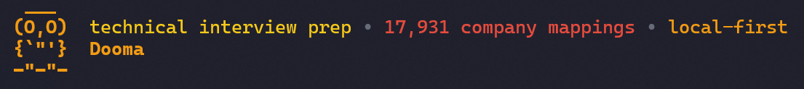
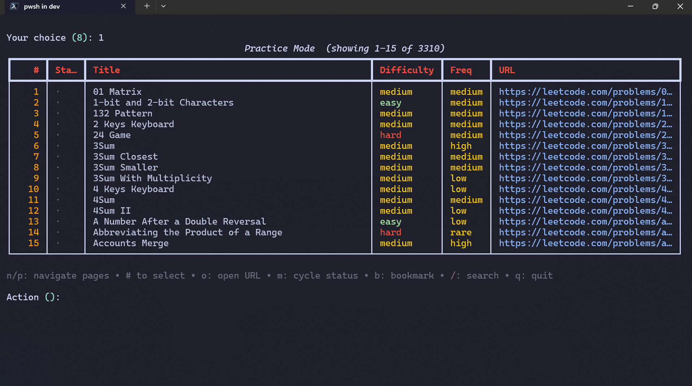
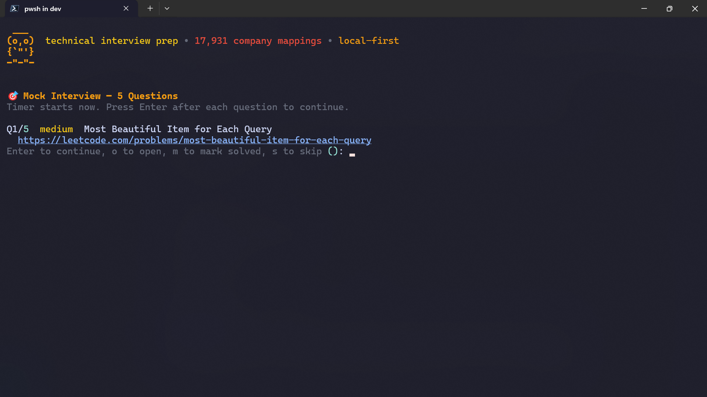
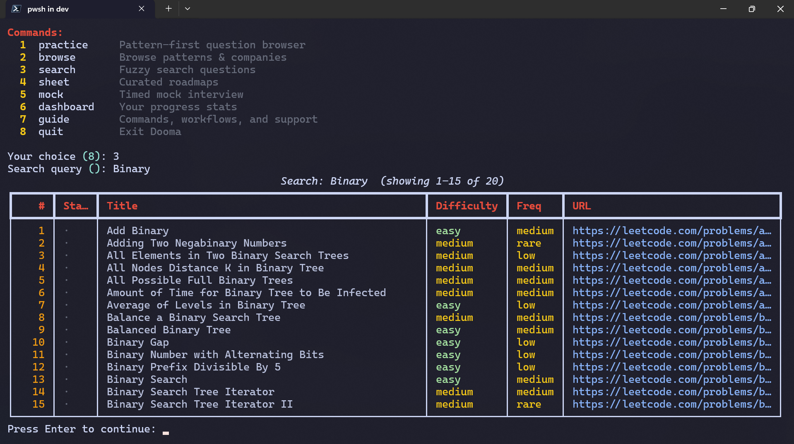
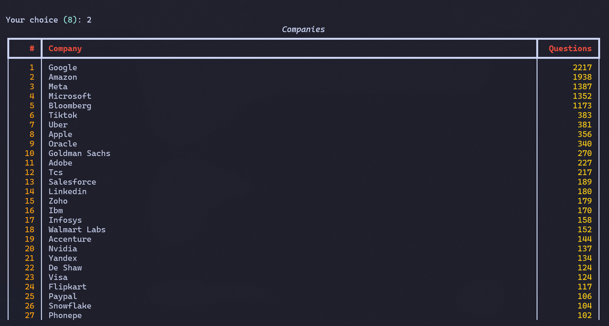
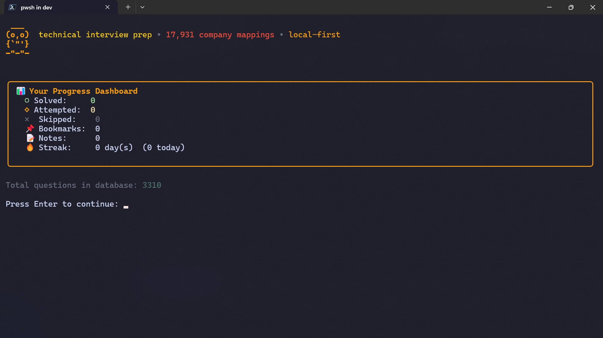
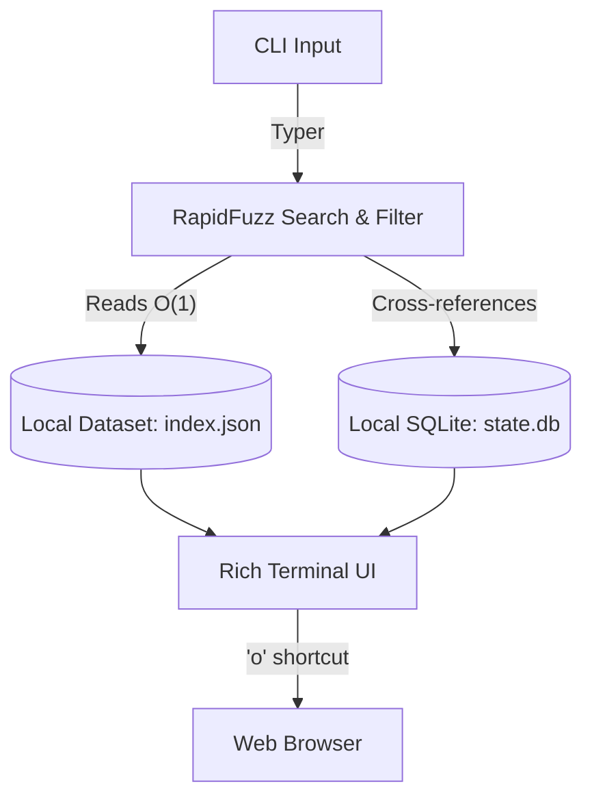

<p align="center">
  
</p>

<p align="center">
  <strong>The local-first terminal workspace for technical interview prep.</strong><br>
  Search 3,310 questions, browse 17,931 mappings across 662 companies, and track progress—all in the CLI.
</p>

<p align="center">
  <a href="https://github.com/im-anishraj/dooma/actions/workflows/ci.yml"></a>
  <a href="https://pypi.org/project/dooma/"></a>
  <a href="https://www.python.org/downloads/"></a>
  <a href="https://opensource.org/licenses/MIT"></a>
  <a href="https://pepy.tech/project/dooma"></a>
</p>

---

## ⚡ Quickstart

```bash
pip install dooma
dooma
```

Using Dooma on Windows? See the [Windows terminal troubleshooting guide](docs/windows-terminal-troubleshooting.md) for help with missing icons, text encoding, and narrow layouts.

### See Dooma in Action

<p align="center">
  
  
</p>
<p align="center">
  
  
</p>
<p align="center">
  
</p>

---

## 🔒 The Local-First Advantage

Modern preparation tools demand sign-ups, track analytics, rely on internet connectivity, and force you to navigate distracting web interfaces. Dooma flips this model. 

- **Instant Discovery:** Sub-millisecond RapidFuzz search across 3,310 questions.
- **Company-Focused:** Access curated, up-to-date question pools for 662 companies (including Google, Amazon, Meta).
- **Zero Distractions:** Launch timed mock interview sessions directly in your CLI. No browser tabs required.
- **Absolute Privacy:** Your activity, notes, and solve rates are written directly to your local `~/.dooma/state.db`. Nothing is ever uploaded.

---

## 🛠️ Workflows

Launch the interactive workspace simply by running `dooma`.

| Command | Purpose |
| --- | --- |
| `dooma practice` | Interactively browse the question database |
| `dooma browse companies`| Explore question pools mapped to specific companies |
| `dooma search <query>` | Fuzzy search questions by keyword or topic |
| `dooma sheet blind-75` | Work through curated industry-standard roadmaps |
| `dooma mock` | Start a timed, randomized mock interview session |
| `dooma dashboard` | Review your solve rates, local progress, and streaks |
| `dooma bookmarks` | Access your saved and starred questions |

> [!TIP]
> **Command Chaining:** Try `dooma mock --count 3 --difficulty hard` to jump straight into a tough session.

### Interactive Hotkeys

While inside any question flow, use these hotkeys to update your local state instantly:

| Key | Action |
| :---: | --- |
| `o` | Open the problem URL in your browser |
| `m` | Cycle status (unsolved → attempted → solved → skipped) |
| `Space` | Toggle bookmark |
| `n` | Write or edit a private local note |
| `q` | Return to the previous menu |

---

## 🏗️ Architecture

Dooma is designed to be extremely lightweight, utilizing a precompiled dataset to achieve sub-second startup times.

<details>
<summary><strong>View System Workflow</strong></summary>



</details>

<details>
<summary><strong>View Codebase Structure</strong></summary>

```text
dooma/
├── dooma/               # Core application logic
│   ├── cli/             # Typer command definitions
│   ├── dataset/         # Local-first JSON data models
│   ├── db.py            # SQLite state management
│   ├── display.py       # Rich UI rendering
│   └── loader.py        # Dataset index loading
├── scripts/             # Internal utilities (YAML -> JSON compilation)
└── tests/               # Pytest suite
```

</details>

---

## 🚀 Project Vision

Our goal is to build the definitive local-first hub for technical interview preparation. We aim to bridge the gap between problem discovery (knowing *what* to solve) and deliberate practice (tracking *how* you solve it)—all from the terminal where engineers already feel most at home.

---

## 🗺️ Roadmap

We are actively building the future of local-first interview prep. 

| Phase | Focus | Impact |
| --- | --- | --- |
| **Now** | **Pattern Taxonomy** | Mapping 3,310 questions to 25 distinct patterns to enable pattern-based learning. |
| **Now** | **Dataset Validation** | Hardening the YAML validation pipeline to ensure high data integrity for new contributions. |
| **Next** | **Curated Sheets** | Integrating the complete NeetCode 150 and Striver SDE roadmaps. |
| **Future** | **Spaced Repetition** | Introducing an algorithm to resurface challenging questions based on local metrics. |

---

## 🤝 Contributing

We want to make contributing to Dooma as seamless as using it. **First-time contributors are explicitly welcome!**

### Where We Need Help

- 🐍 **Python Developers:** Optimize RapidFuzz search ranking, add regression tests, and expand CLI features.
- 🎨 **UI Designers:** Refine the Rich terminal rendering for edge cases in narrow or non-standard terminals.
- 📊 **Data Enthusiasts:** Help map the remaining Blind 75, NeetCode 150, and Striver SDE questions. Check issues labeled [`area:data`](https://github.com/im-anishraj/dooma/labels/area%3Adata).

### Good First Issues

Looking for an easy place to start? 
1. Check the [good first issue](https://github.com/im-anishraj/dooma/labels/good%20first%20issue) label.
2. The highest impact task right now is adding **pattern tags** to existing questions in the YAML dataset.

### Development Workflow

1. **Clone and install dependencies:**
   ```bash
   git clone https://github.com/im-anishraj/dooma.git
   cd dooma
   pip install -e ".[dev]"
   ```
2. **Run tests and verify standards:**
   ```bash
   ruff check .
   mypy dooma
   python -m pytest
   ```
3. **Rebuild index (if modifying dataset YAMLs):**
   ```bash
   python scripts/build_index.py
   ```

Please read our [CONTRIBUTING.md](CONTRIBUTING.md) guide before opening a pull request.

---

## 💬 Community

- [GitHub Discussions](https://github.com/im-anishraj/dooma/discussions) - Ask questions, share ideas, and follow announcements.
- **Discord** - *(Coming soon)*

---

## ❓ FAQ

**Does Dooma submit code for me or require a LeetCode Premium account?**  
No. Dooma provides metadata, problem categorization, and direct links. You do not need a premium account to use Dooma, but you will need an account on the respective platform (like LeetCode) to submit your actual code.

**Where is my data stored? Can I sync it?**  
All state (bookmarks, notes, progress) is stored locally in `~/.dooma/state.db`. You can sync this SQLite file across machines using Dropbox, iCloud, or Syncthing.

**How do I completely reset my progress?**  
You can reset your onboarding config via `dooma config --reset` or safely delete the `~/.dooma` directory to start completely fresh.

---

## 📄 License & Conduct

Released under the [MIT License](LICENSE).  
By participating in this project, you agree to abide by our [Code of Conduct](CODE_OF_CONDUCT.md).
