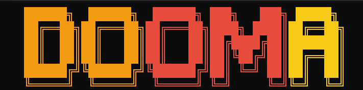

<p align="center">
  
</p>

<p align="center">
  <strong>technical interview prep • 17,931 company mappings • local-first</strong><br>
  Search 3,310 questions, browse company mappings, run mock sessions, and track progress locally.
</p>

<p align="center">
  <a href="https://github.com/im-anishraj/dooma/actions/workflows/ci.yml"></a>
  <a href="https://pypi.org/project/dooma/"></a>
  <a href="https://www.python.org/downloads/"></a>
  <a href="https://opensource.org/licenses/MIT"></a>
  <a href="https://pepy.tech/project/dooma"></a>
</p>

Dooma is a fast, offline-first terminal workspace for technical interview preparation. It turns scattered interview-prep data into a focused CLI workflow—giving you a fast way to find what companies ask, open the exact LeetCode-style problem, and track your progress without accounts or network dependencies.

---

## ⚡ Quickstart

```bash
pip install dooma
dooma
```

<!-- TODO: Insert Demo GIF / Screenshot here -->

---

## ❤️ Why Developers Love Dooma

- **Company-First Discovery:** Browse up-to-date question pools for companies like Google, Amazon, Meta, Microsoft, and Bloomberg.
- **Lightning Fast Search:** Jump directly from rough text (like `two sum` or `binary tree`) to the exact question.
- **Offline-First Runtime:** Packaged with a prebuilt index, eliminating the need to parse thousands of files or wait for network requests.
- **Private Progress Tracking:** Your solved problems, notes, bookmarks, and streaks live entirely locally in `~/.dooma`.
- **Keyboard-Driven Workflow:** Manage everything from the terminal without breaking your flow.

---

## 🔒 Why Local-First?

Preparing for technical interviews is deeply personal and requires intense focus. You shouldn't have to navigate distracting dashboards, sign in to accounts, or rely on an internet connection just to figure out what to practice next. 

By operating entirely locally, Dooma ensures that your data remains yours. Your progress, notes, and activity are never scraped, uploaded, or synced to a remote server. It's just you, your terminal, and the code.

---

## 🛠️ Features & Workflows

Launch the interactive hub simply by running `dooma`. From there, you can navigate through the primary workflows:

| Command | Purpose |
| --- | --- |
| `dooma practice` | Browse questions interactively |
| `dooma browse companies`| Explore question pools by company |
| `dooma search <query>` | Fuzzy search questions by keyword |
| `dooma sheet blind-75` | Work through curated roadmaps |
| `dooma mock` | Start a timed mock interview session |
| `dooma dashboard` | View your local progress and streaks |
| `dooma bookmarks` | Access your saved questions |
| `dooma doctor` | Check dataset and database health |

### Interactive Question Actions

While inside any practice, company, or sheet flow, use these hotkeys:

- **`o`** – Open the problem URL in your browser
- **`m`** – Cycle status: `unsolved -> attempted -> solved -> skipped`
- **`b`** – Toggle bookmark
- **`n`** – Add or edit a local note
- **`q`** – Go back

---

## 🏗️ Architecture & Tech Stack

Dooma processes raw YAML datasets into a high-performance runtime JSON index, rendering data through a rich CLI interface.

| Category | Technology |
|----------|-------------|
| Language | Python 3.9+ |
| CLI Framework | Typer |
| Terminal UI | Rich |
| Search | RapidFuzz |

<details>
<summary><strong>View High-Level Data Flow</strong></summary>

```text
User Command
     │
     ▼
Load Local Dataset (index.json)
     │
     ▼
Filter Companies / Questions
     │
     ▼
Render Rich Terminal UI
     │
     ▼
Interactive Navigation
```

</details>

<details>
<summary><strong>View Project Structure</strong></summary>

```text
dooma/
├── .github/             # GitHub workflows and issue templates
├── dooma/               # Core application package
│   ├── cli/             # Typer commands and home screen
│   ├── dataset/         # Company-question datasets (legacy JSON)
│   ├── db.py            # SQLite progress & state handling
│   ├── display.py       # Rich terminal rendering
│   └── loader.py        # Index loader
├── scripts/             # Dataset build (YAML -> JSON) utilities
├── tests/               # Unit and integration tests
├── README.md            # Project documentation
└── RELEASES.md          # Changelog
```

</details>

---

## 🚀 Project Vision

Dooma's long-term vision is to become the definitive offline hub for developers preparing for technical interviews. We aim to bridge the gap between problem discovery (knowing *what* to solve) and deliberate practice (tracking *how* you solve it), all without leaving the terminal environment where developers already feel most at home.

### Current Priorities
- **Pattern Categorization:** Expanding taxonomy tags for all problems.
- **Curated Sheets:** Full mapping for NeetCode 150 and Striver SDE sheets.
- **Dataset Validation:** Hardening the validation pipeline for new question additions.

---

## 🗺️ Roadmap

| Feature | Status | Details |
| --- | :---: | --- |
| **Company Mappings** | ✅ | 17,931 mappings across 662 companies |
| **Question Database** | ✅ | 3,310 unique questions |
| **Blind 75 Sheet** | 🟡 | 71 questions mapped |
| **Pattern Taxonomy** | 🟡 | 25 pattern entries (tags pending) |
| **NeetCode 150 Sheet** | ⏳ | Definitions exist, mapping needed |
| **Striver SDE Sheet** | ⏳ | Definitions exist, mapping needed |

---

## 🤝 Looking for Contributors

**First-time contributors are explicitly welcome!** Whether you're a Python expert, a technical writer, or a data enthusiast, there's a place for you here. 

We are currently looking for:
- 🐍 **Python Developers:** CLI improvements, tests, and performance tweaks.
- 🎨 **UI Contributors:** Refining the Rich terminal rendering for edge cases.
- 📊 **Dataset Contributors:** Mapping questions, adding patterns, and fixing metadata.
- 📝 **Documentation:** Improving tutorials, comments, and guides.

### Good First Issues

The best way to get started is by tackling practical, data-driven tasks:
1. Check issues labeled [`good first issue`](https://github.com/im-anishraj/dooma/labels/good%20first%20issue) or [`area:data`](https://github.com/im-anishraj/dooma/labels/area%3Adata).
2. Help map missing pattern tags to existing questions.
3. Add missing problems to curated sheets (like NeetCode 150).

### Development Guide

1. Clone and install dependencies:
   ```bash
   git clone https://github.com/im-anishraj/dooma.git
   cd dooma
   pip install -e ".[dev]"
   ```
2. Run tests and linters:
   ```bash
   ruff check .
   mypy dooma
   python -m pytest
   ```
3. Update the dataset index (if changing YAML files):
   ```bash
   python scripts/build_index.py
   ```

Please read [CONTRIBUTING.md](CONTRIBUTING.md) before submitting a pull request.

---

## 💬 Community

<!-- TODO: Add links to Discord / GitHub Discussions / Website -->
- [GitHub Discussions](https://github.com/im-anishraj/dooma/discussions) - Ask questions, share ideas, and follow announcements.
- **Discord** - *(Coming soon)*
- **Website** - *(Coming soon)*

---

## ❓ FAQ

**Does Dooma require a LeetCode Premium account?**  
No. Dooma provides metadata, categorization, and links. You will need your own account to actually submit code on the respective platform.

**Does Dooma submit code for me?**  
No. Dooma is an offline tracker and discovery hub, not an online judge.

**Can I sync my progress across machines?**  
Currently, all state is stored in `~/.dooma/state.db`. You can manually back up or sync this SQLite file using Dropbox, Syncthing, or a similar tool.

**How do I completely reset my progress?**  
You can reset onboarding config via `dooma config --reset` or safely delete the `~/.dooma` directory to start fresh.

---

## 📄 License & Conduct

Released under the [MIT License](LICENSE).  
By participating in this project, you agree to abide by our [Code of Conduct](CODE_OF_CONDUCT.md).
